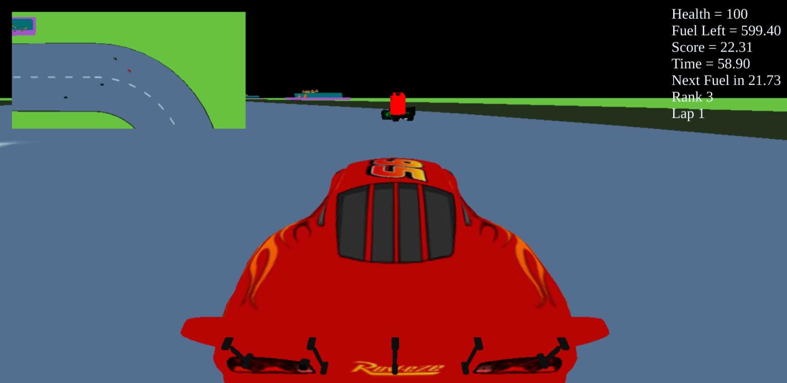

# Lightning Racing Game

A thrilling 3D racing game inspired by Lightning McQueen, built with Three.js. Race against AI opponents, manage your fuel, and complete three laps to victory!

**[Play the game live](https://ishwarbb.github.io/3D-Car-Racing-Game/)** — best on a desktop browser with a keyboard.

## Game Features

Experience an immersive 3D racing environment complete with a stadium, cheering audience, and a challenging race track filled with twists and turns. The game features a dual-view system, giving you both a main racing perspective and a helpful minimap for strategic navigation.

The racing mechanics are designed to be engaging and realistic, featuring smooth car controls with drifting capabilities. You'll need to manage your fuel and health while competing against AI-controlled opponents. The game tracks your progress with a real-time dashboard showing your score, lap times, and vital statistics.



Strategic gameplay elements include randomly spawning fuel cans that you'll need to collect to stay in the race. Keep an eye on your health and avoid collisions with other racers as you aim to complete three exciting laps!

## Prerequisites

Before you begin, ensure you have Node.js installed on your system.

## Installation

1. Clone the repository:
```bash
git clone https://github.com/ishwarbb/3D-Car-Racing-Game
cd 3D-Car-Racing-Game
```

2. Install the dependencies:
```bash
npm install
```

## Running the Game

1. Build the bundle (required after any code changes):
```bash
npm run build
```

2. Start the local server:
```bash
npm start
```

3. Open the printed URL (defaults to http://localhost:8080/) in your browser to play.

## Controls

- **W**: Accelerate
- **S**: Brake/Reverse
- **A**: Turn Left
- **D**: Turn Right
- **Drifting**: 
  - Press S + A for left drift
  - Press S + D for right drift
  - Note: Don't accelerate while drifting!

## Game Objectives

1. Complete 3 laps before running out of fuel
2. Collect fuel cans to maintain your fuel level
3. Avoid collisions with other cars to preserve health
4. Use drifting strategically to maintain speed in turns

## Gameplay Tips

- Monitor your fuel gauge constantly
- Plan your route to collect fuel cans efficiently
- Use drifting for tight corners, but time it carefully
- Watch out for aggressive AI opponents
- Keep an eye on the minimap for strategic positioning

## Troubleshooting

If you encounter any issues:
1. Ensure all assets are properly downloaded and placed in the correct directory
2. Check if all dependencies are properly installed
3. Clear your browser cache if you experience display issues
4. Make sure you're using a modern browser with WebGL support

## Development

The game is built using:
- Three.js for 3D rendering
- Webpack for bundling
- Custom physics engine for car mechanics
- System logic for opponent cars

## Deployment

The game is served on GitHub Pages directly from the `main` branch. A root
[index.html](index.html) redirects to the built game in `dist/`, and the committed
`dist/` bundle plus the `assets/` folder are served as-is.

To enable it on a fork: go to **Settings → Pages**, set **Source** to
**Deploy from a branch**, and choose **main** / **/ (root)**. After changing any
source code, rebuild with `npm run build` and commit the updated `dist/main.js`.

## Credits

- 3D models and textures sourced from [Sketchfab](https://sketchfab.com).
  These assets remain under their respective Sketchfab licenses and are not
  covered by this repository's MIT license.

## License

The source code in this repository is licensed under the [MIT License](LICENSE).
